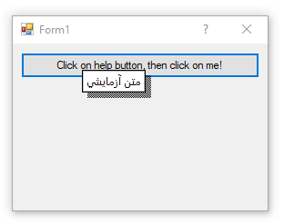
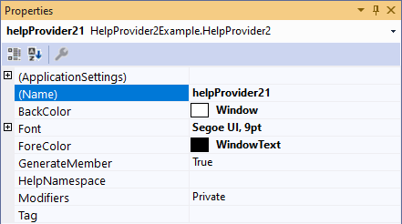

# HelpProvider Popoup with Unicode support

When you use the built-in [HelpProvider](https://docs.microsoft.com/en-us/dotnet/api/system.windows.forms.helpprovider?view=net-5.0&WT.mc_id=DT-MVP-5003235) or try to show a help popup using [Help.ShowPopup](https://docs.microsoft.com/en-us/dotnet/api/system.windows.forms.help.showpopup?view=net-5.0&WT.mc_id=DT-MVP-5003235), if you specify a string containing special Unicode characters like Persian or Arabic characters, the popup doesn't show those characters correctly.

The because of two problems:

* The default font which is used by underlying API of the HelpProvider doesn't support unicode characters
* The underlying API of the HelpProvider doesn't support Unicode.

The first problem is in `Help` class([.NET 4.X](https://referencesource.microsoft.com/?WT.mc_id=DT-MVP-5003235#System.Windows.Forms/winforms/Managed/System/WinForms/Help.cs,160), [.NET 5](https://github.com/dotnet/winforms/blob/6391b524dd64e7530eba986c6607bf129b3ec8ae/src/System.Windows.Forms/src/System/Windows/Forms/Help.cs?WT.mc_id=DT-MVP-5003235#L106)) which has created the [`HH_POPUP`](https://docs.microsoft.com/en-us/windows/win32/api/htmlhelp/ns-htmlhelp-hh_popup?WT.mc_id=DT-MVP-5003235) but hasn't specified any font for it. As a result a default font which doesn't support Unicode characters will be used. 

* A possible fix is using a default font like `SystemFonts.CaptionFont` which supports Unicode characters.

For the second problem, you need to change a setting in Windows, to do so:

* Go to Control Panel → Region → Administratve tab, then in the section "Language for non-Unicode programs", click on "Change system locale ..." button and then in the next dialog, choose the language of your choice, for example Persian.

In this example I've created a `HelpProvider2` component which supports unicode characters:

It also exposes `Font`, `ForeColor` and `BackColor` properties:

The example also contains a `HelpExtensions.ShowPopup2` which can be used instead of `Help.ShowPopoup`:

    HelpExtensions.ShowPopup2(button1, "متن آزمایشی", Control.MousePosition);
